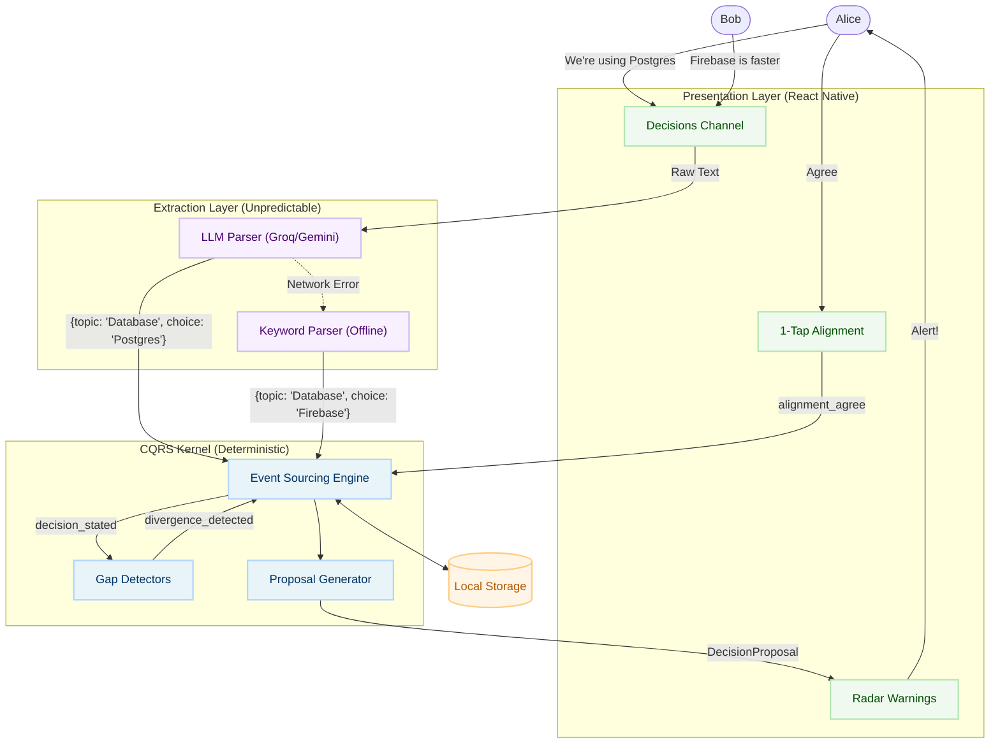

<div align="center">
  <!-- TODO: Insert Hero GIF/Screenshot here showing the Radar resolving an Alice/Bob conflict -->
  <!--  -->

  <h1>Isolyne</h1>
  <p><b>The disagreement detector for teams that move too fast to argue.</b></p>
  <p><i>Your teammate is building on Firebase. You're building on Postgres. Neither of you knows.</i></p>

  <p>
    <a href="https://github.com/ABHIGH15/ISOLYNE/actions"></a>
    <a href="https://www.typescriptlang.org/"></a>
    <a href="https://expo.dev/"></a>
    <a href="https://opensource.org/licenses/MIT"></a>
  </p>
</div>

---

## 🛑 The Problem

Small teams don't fail from bad code. They fail from the illusion of agreement. 

Traditional project management tools (Jira, Linear) demand heavy upfront bureaucracy and get abandoned within four hours of a hackathon. Team chat (Slack, Discord) buries critical architectural decisions in noise. 

**Isolyne** sits between them: builders state their assumptions in natural language, and a pure event-sourced mathematical kernel continuously projects shared reality and alerts the team the exact moment a contradiction occurs—before 3 AM integration hell.

---

## ✨ What We Built

We built a mobile-native, offline-capable radar that watches your team's assumptions without getting in the way. 

### 1. The Core Loop
* **State:** Casually tell Isolyne what you're working on ("I'm doing auth with Postgres").
* **Detect:** Isolyne's deterministic CQRS kernel mathematically compares your statement against the rest of the squad.
* **Resolve:** If someone else stated Firebase, the Radar immediately flags the divergence and prompts a 1-tap alignment resolution.

### 2. Privacy-First Extraction
We use an LLM (Groq Llama 3 / Gemini) to extract structured JSON (`{ topic: 'Database', choice: 'Postgres' }`) from casual chat. Crucially, we built a **completely offline local keyword parser** as the ultimate fallback. Your team's internal disagreements and architectural secrets never have to leave the device.

### 3. Asynchronous Drift Alerts (Push Notifications)
Drift happens asynchronously, so detection has to be proactive. Isolyne features real-time local push notifications with intelligent idempotency deduping. The moment a teammate contradicts an established assumption, your phone buzzes with the exact conflict. One tap deep-links you straight into the resolution flow.

### 4. The Detector Taxonomy
We identified the 8 most critical coordination failures in fast-moving teams. We have fully built and shipped **4 out of 8** for this release:
* ✅ **Consensus Gap:** Two people commit to different technical solutions for the same domain.
* ✅ **Interpretation Gap:** The team uses the same words but defines the MVP/Scope differently.
* ✅ **Timeline Gap:** Team members hold misaligned or ambiguously defined deadlines.
* ✅ **Ownership Gap:** A critical decision has no designated final decider, leading to deadlock.

### 5. Passive Ingestion (Discord Companion Bot)
Detection logic shouldn't be locked to a single UI. We built a fully typed Discord Bot proof-of-concept that runs the exact same pure CQRS kernel to passively catch silent divergence directly in the channels where your team already chats.

---

## 🏗 Architecture

Isolyne deliberately isolates LLM unpredictability. The LLM is **never** used to decide if the team is aligned—it only extracts nouns.



---

## 🚀 Quick Start

Get the app running locally in under 60 seconds.

```bash
# Clone the repository
git clone https://github.com/ABHIGH15/ISOLYNE.git
cd ISOLYNE

# Install dependencies
npm install

# Run the invariant test suite (65/65 passing)
npm test

# Start the Expo development server
npx expo start
```

*Note: Isolyne operates perfectly without an API key using the offline deterministic fallback parser. For the full LLM extraction experience, provide an `EXPO_PUBLIC_GROQ_API_KEY` in your `.env`.*

---

## 💰 Monetization (RevenueCat)

Isolyne uses **RevenueCat** to power its "Purchase-as-Story-Beat" model. 

Basic alignment and detection are **100% free forever**—no project breaks because of a paywall. Isolyne Pro is offered the exact second the squad's Radar goes red on an active divergence. The paywall triggers exactly when the emotional and practical value of alignment is undeniable.

Pro monetizes the permanent record: unlocking retrospective exports, immutable signal audit trails, and cross-project organizational memory. We utilize RevenueCat's Native **Customer Center** to seamlessly manage retention flows, cancellation surveys, and automated discount offers.

---

## 🗺 What's Planned (Roadmap)

Our vision is to make the mobile coordination experience completely frictionless. Here is what we are building next:

* 🚧 **The Remaining Detectors:** Shipping the final 4 logic gaps (*Authority, Allocation, Context, Execution*).
* 🚧 **The Daily Temp Check:** Replacing ambient tracking with a single daily push notification ("Did anything change since yesterday?") that opens a 1-tap mini-scratchpad.
* 🚧 **Live Activities & Dynamic Island:** Broadcasting the team's Radar status live on the iOS lock screen during active build sessions, so you always know if the team is aligned without even unlocking your phone.
* 🚧 **Isolyne Pro Retrospectives:** Expanding our RevenueCat integration to export the immutable, chronological event log into sprint retrospectives, helping teams learn exactly where and when communication broke down.
* 🚧 **Cloud Sync:** Migrating the pure `AsyncStorage` state to a real-time CRDT backend to sync multiple physical devices seamlessly.

---

<div align="center">
  <i>Built for the RevenueCat Shipaton 2026 · Next Gen Track</i>
</div>
