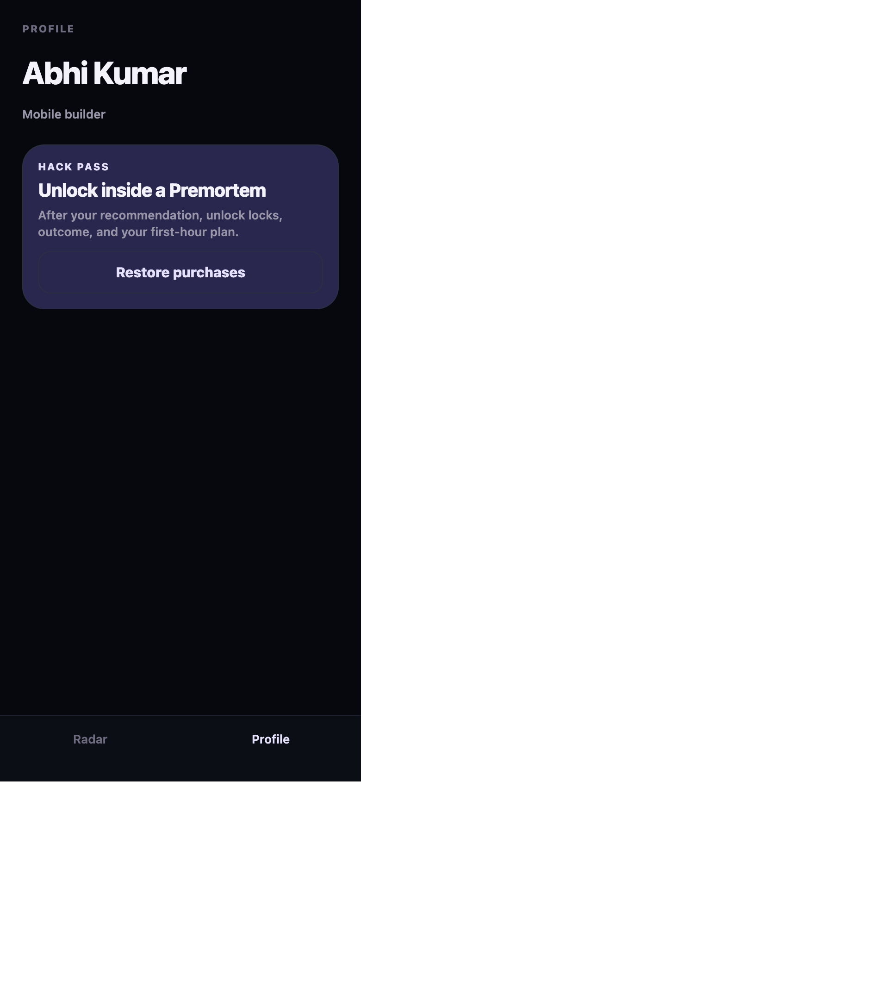
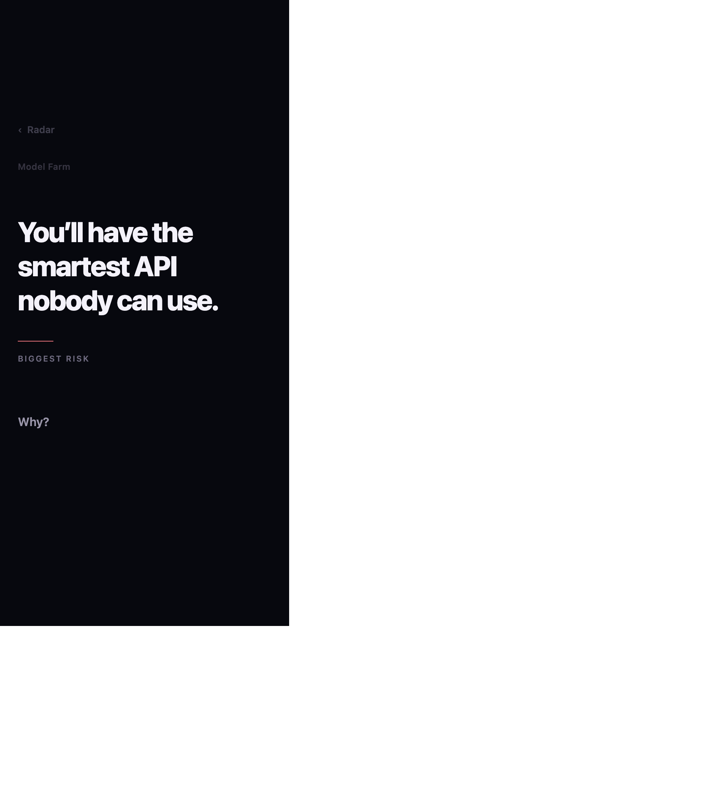
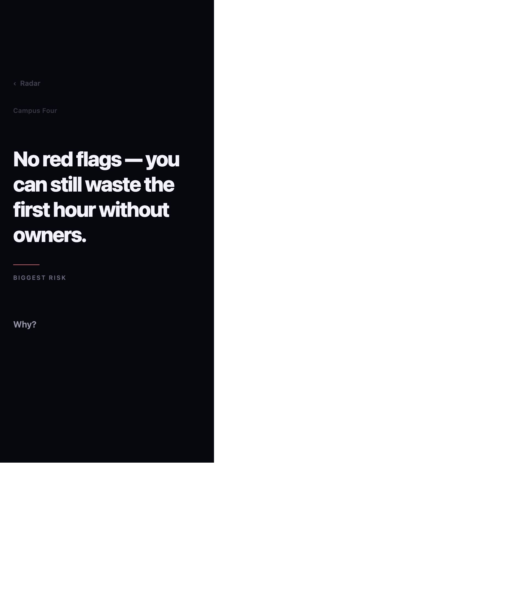
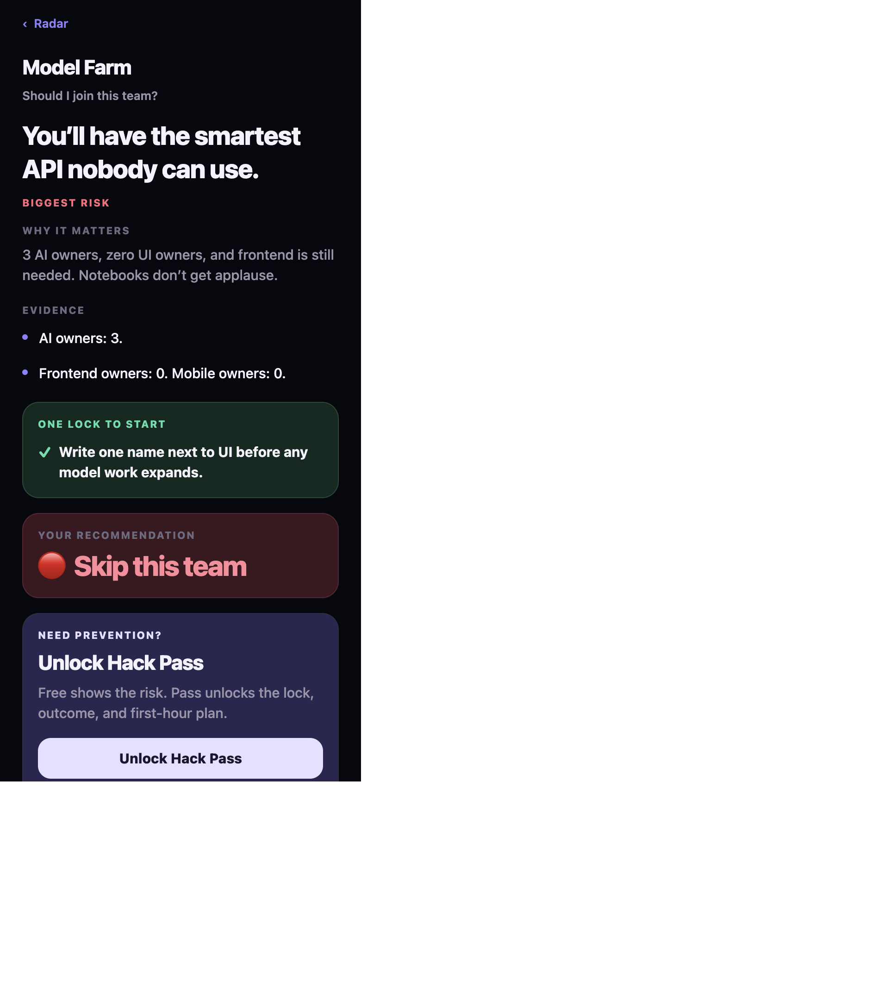
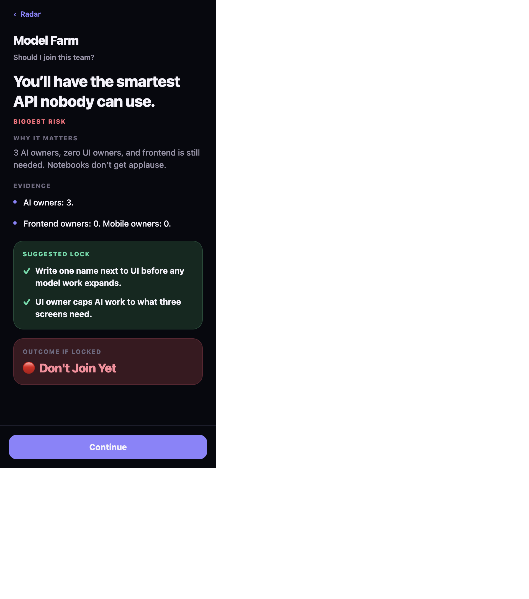
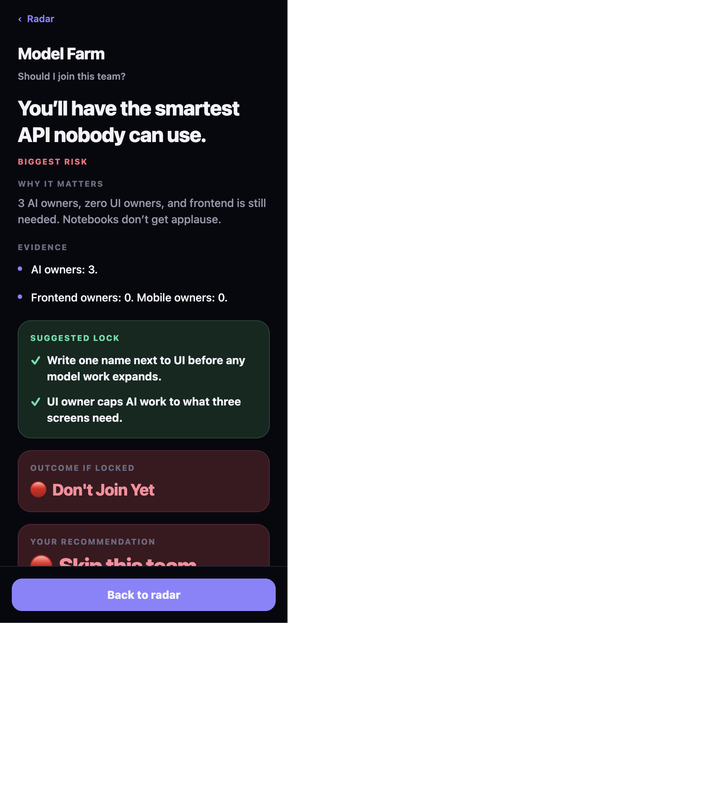
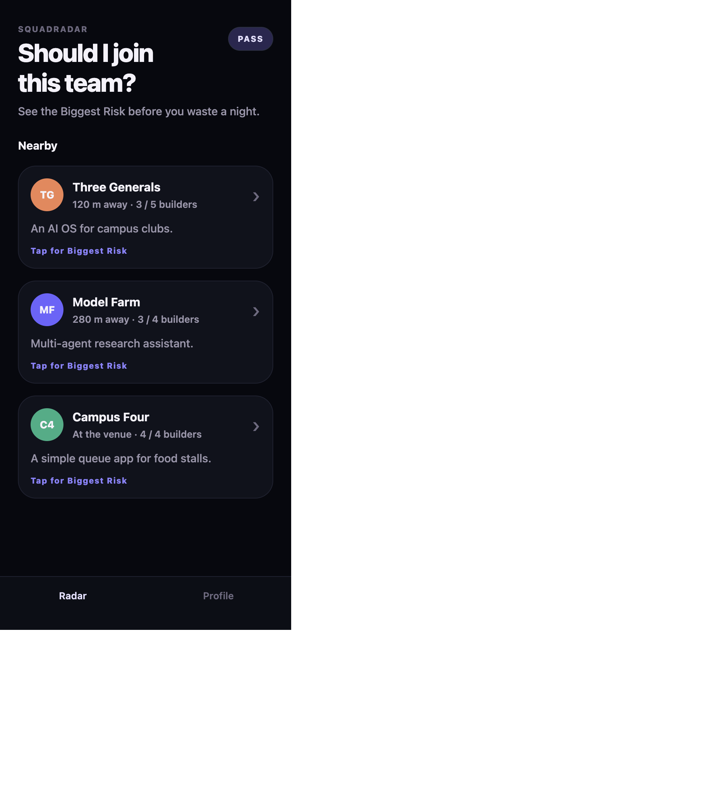

# Phase F.1 — Founder Acceptance Test

**Role:** Founder · QA Lead · UX Researcher · Shipaton Judge  
**Method:** Used the live app at `http://localhost:8082` (mobile viewport). Judged only what was experienced.  
**Date:** 2026-08-16  
**Constraint:** No new features. No architecture. Rank only win-probability craft.

Evidence screenshots: [`docs/acceptance/`](./acceptance/)

---

## Journey 1 — First Launch

**What happened**
- Splash/spinner → Radar.
- **No onboarding. No create-profile step.**
- Landed as **Abhi Kumar / Mobile builder** with no consent or edit path.
- Profile tab shows identity + Hack Pass restore only — **cannot change name or role.**

| Criterion | Experience |
|---|---|
| First impression | Strong question. Dark stage. Feels intentional. |
| Clarity | North-star is clear. “Nearby / 120 m” still reads social map. |
| Friction | Zero setup friction — but also zero ownership of identity. |
| Confusion | FREE badge with no explanation. Profile exists but isn’t a profile. |
| Time to first value | Excellent — tap a team in &lt;5s. |

**Material issues**
1. Profile is a facade (no create/edit) — demo confidence leak for judges who open Profile.  
2. Hardcoded founder name on “fresh install” breaks first-person belief.  
3. No onboarding is fine for Shipaton speed — but Profile shouldn’t pretend otherwise.

---

## Journey 2 — Discovery

Opened all three Premortems.

| Team | Biggest Risk (experienced) | Rec (free) | Distinct? |
|---|---|---|---|
| Three Generals | You’ll have three captains and no ship. | Join if… | Yes — leadership |
| Model Farm | You’ll have the smartest API nobody can use. | Skip | Yes — AI without UI |
| Campus Four | No red flags — you can still waste the first hour without owners. | Join | Weaker — “Biggest Risk” label on a soft warning |

| Criterion | Experience |
|---|---|
| Radar curiosity | Partial — question helps; meters dilute. |
| Teams distinct | Yes for TG + MF. Campus Four feels like filler for the demo. |
| Engine believable | Yes when punchlines are specific. Campus Four undercuts trust (“Biggest Risk” ≠ red flag). |

**Material issues**
4. Distance language (“120 m / 280 m”) competes with decision-tool positioning.  
5. Campus Four labeled **BIGGEST RISK** for a non-risk line — semantic inconsistency.  
6. Idea blurbs on cards invite idea-matching, not composition judgment.

---

## Journey 3 — Hero Moment (Three Generals)

Experienced Pass 1 recomposition: sentence first, metadata below, quiet Why?, air.

| Criterion | Experience |
|---|---|
| Emotional impact | High — sentence lands as accusation. |
| Visual hierarchy | Sentence owns the stage (when full-width). |
| Memorability | Highest in the app. |
| Sentence lands | Yes. |

**Material issues**
7. Occasional **narrow left-column layout** on web (Campus Four capture) — sentence doesn’t own full width; destroys composition.  
8. Line breaks still feel wrapped, not written (cinema/poetry debt — craft, not code architecture).  
9. Top chrome still announces “app” before the sentence (known Pass 1 residue).

*Pass 2 silence not scored here — no muted recording submitted.*

---

## Journey 4 — Hack Pass

**Free end (Model Farm)**  
Risk → Why → Lock teaser → 🔴 Skip → Need prevention? Unlock Hack Pass

**After unlock**  
Gate vanishes → Outcome “Don’t Join Yet” appears; recommendation briefly lost in step jump; then full locks + First-Hour after Continues.

| Criterion | Experience |
|---|---|
| Upgrade earned? | Partially — flinch is real; value story is muddy. |
| Value obvious? | **Weak.** Free already shows a full actionable lock (“ONE LOCK TO START”). Copy says Pass unlocks “the lock.” |
| Judge understands purchase? | Outcome + First-Hour are the real Pass delta — under-sold; lock is over-sold. |

**Material issues**
10. **Hack Pass value proposition lies by omission** — free lock teaser looks complete.  
11. **Unlock mid-flow jumps step 4→3** — recommendation disappears momentarily; story hiccups.  
12. Sticky footer **covers** recommendation / plan content — must scroll fight the CTA.  
13. Outcome “Don’t Join Yet” + Recommendation “Skip this team” feels redundant / slightly contradictory wording.  
14. After unlock, Radar shows **PASS** badge — fine — but Profile still says “Unlock inside a Premortem” until revisited carefully; restore path is odd for never-purchased users.

---

## Journey 5 — End-to-End friction (15–20 min stress)

| Friction | Severity |
|---|---|
| Leave Premortem midway via ‹ Radar — OK, state resets to step 0 on reopen | Low |
| Revisit teams — works; PASS persists across teams after unlock | Expected |
| Reopen with cleared storage — still “Abhi Kumar” | High (belief) |
| Repeated Continue taps feel mechanical after hero | Medium (demo pacing) |
| Bottom nav invisible during Premortem — good | — |
| Profile during demo — trap for judges | High if opened |
| Web layout squeeze on hero | High for gallery/web judges |
| No way to clear Pass except Profile “Clear Hack Pass” (when entitled) | OK for testing |

---

## Judge Review (scores)

| Dimension | Score | Deductions |
|---|---:|---|
| **Memorability** | **8.8** | Hero sentence 10; Radar + Campus Four dilute memory of “one product.” |
| **Design Craft** | **8.2** | Hero stage strong; card stack + footer clash + web width bug feel assembled. |
| **Product Confidence** | **7.6** | Fake profile, FREE/PASS chrome without story, Pass copy mismatch. |
| **Emotional Journey** | **8.7** | Curiosity→tension strong on TG/MF; Campus Four soft; Pass relief incomplete. |
| **Storytelling** | **8.5** | Silent Premortem works; Radar still narrates “nearby networking.” |
| **Shipaton Competitiveness** | **8.0** | Idea is award-tier; polish gaps (Pass clarity, profile facade, Campus Four label, footer) cost Design points. |

**Overall ~8.3 / 10** — submitable with craft work; not “submit today and sleep well” for Design.

---

## UX Audit (inventory)

### Confusing
- FREE / PASS badge before knowing what Pass is  
- Profile that isn’t editable  
- “BIGGEST RISK” on Campus Four’s soft line  
- Pass copy vs free lock teaser  
- Don’t Join Yet vs Skip  

### Unnecessary taps
- Multiple Continues after Why? (acceptable for disclosure; feels long in stress test)  
- Restore purchases with nothing to restore  

### Hesitation points
- First second on Radar: networking vs decision tool  
- After recommendation: why pay if lock already shown?  
- After unlock: where did recommendation go?  

### Inconsistencies
- Hero composition (sentence-first) vs later stack (cards) — intentional but jarring  
- Coral-only on hero; lavender Continues elsewhere  

### Unfinished / demo-only
- Hardcoded profile  
- Seeded “nearby” distances  
- Local unlock without store (invisible — good) but Profile restore language is store-native  

### Placeholders
- None literal (“TODO”) — facade profile is the soft placeholder  

### Visual imbalance
- Footer overlapping content  
- Intermittent hero width collapse on web  
- Large empty Profile void  

### Copy
- “Pass unlocks the lock” when free shows a lock  
- “Nearby” / meters  
- Campus Four as Biggest Risk  

---

## Founder Acceptance Verdict

### 1. Would you personally use this at a hackathon?
**Yes — for the Premortem.** I’d open Three Generals / Model Farm–style reads before joining. I would not trust Profile, distances, or Campus Four’s “risk” labeling yet.

### 2. Confidently submit to Shipaton **today**?
**Next Gen: cautious yes** (engine + RC story + hero).  
**Design: no** — Pass clarity, profile facade, Radar framing, and footer/hero layout bugs would cost votes.

### 3. Top 10 highest-impact improvements (win probability only)

| Rank | Improvement | Why it raises win odds | Effort |
|---:|---|---|---|
| 1 | **Fix Hack Pass value story** — free teaser must feel incomplete; Pass must clearly add Outcome + First-Hour (and full locks), not “the lock you already saw” | Judges must *want* Pass | S |
| 2 | **Record muted demo with sacred silence** (Pass 2) | Hotel memory = sentence | M |
| 3 | **Fix unlock step jump** so recommendation doesn’t vanish | Story confidence | S |
| 4 | **Footer must not cover content** (padding / safe area) | Looks unfinished on camera | S |
| 5 | **Fix hero full-width layout** on web (and verify native) | Gallery + web judges | S |
| 6 | **Remove or reframe meters / Nearby** toward decision language | First 5s differentiation | S |
| 7 | **Campus Four labeling** — don’t call soft fallback “Biggest Risk” (or retune seed) | Engine trust | S |
| 8 | **Profile honesty** — hide tab in demo, or allow minimal name/role edit; remove founder hardcode as “you” | Product confidence | S–M |
| 9 | **Composed line breaks** for hero punchlines (Three Generals) | Pass 1 residue → memorability | S |
| 10 | **Soft chrome on hero** (one less competing pixel) | Closer to “…damn.” | XS |

**Explicitly rejected:** new features, onboarding sprawl, more tabs, analytics, AI, Firebase, architecture changes.

---

## Status

| Item | Status |
|---|---|
| Phase F.1 Acceptance Test | ✅ Complete |
| Pass 2 Silence Review | ⏸ Awaiting muted take |
| Product / Engine | Frozen |

Next human artifact for Judge Mode: **muted recording** (Pass 2 format only).  
Next craft queue if building: **Top 10 above, starting at #1–#5.**
