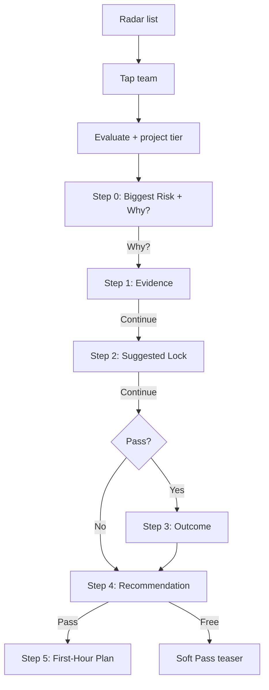

# Phase B — Cinematic Reveal

**Status:** In progress (low-fidelity interaction validation)  
**Engine:** frozen `v1.0.0` — UI is a renderer only

---

## 1. Presentation architecture

```text
Decision Engine (frozen)
        ↓ evaluateDecision(input)
DecisionStory (full truth)
        ↓ projectForTier(story, free|pass)
TieredDecisionStory
        ↓
presentation/decision-story/*  (pure render + reveal state)
        ↓
app Radar / Team detail shell
```

**Rules**
- No rule evaluation in React
- No duplicated copy
- Components accept `TieredDecisionStory` + `formatMessage` only
- Entitlement is a string (`free` | `pass`) chosen outside the engine

---

## 2. UX flow



Golden path time budget: **under 30 seconds** to Recommendation.

---

## 3. Component hierarchy

```text
DecisionStoryReveal
├── BiggestRiskCard          (always step 0)
├── WhyButton / ContinueButton
├── EvidenceList             (step ≥ 1)
├── SuggestedLockCard        (step ≥ 2; teaser on free)
├── OutcomeBadge             (step ≥ 3; pass only)
├── RecommendationCard       (step ≥ 4)
└── FirstHourPlan            (step ≥ 5; pass only)
```

---

## 4. Motion plan (low-fi)

| Moment | Motion | Intent |
|---|---|---|
| Why? | LayoutAnimation easeInEaseOut ~220ms | Curiosity → understanding |
| Continue | Same | Progressive disclosure |
| Section enter | Fade/opacity via LayoutAnimation | Not bounce |
| Recommendation | Slight emphasis (weight/color only) | Hierarchy |

No spring bounce. No parallax. Linear / Notion energy.

---

## 5. Accessibility

- Explicit **Why?** / **Continue** — never auto-only advance
- `accessibilityRole="button"` on controls
- `accessibilityLiveRegion="polite"` when new section appears (Android)
- Contrast: risk text large; secondary copy secondary color
- Hit targets ≥ 44pt
- Screen reader order matches visual reveal order

---

## 6. Free vs Pass

| Section | Free | Pass |
|---|---|---|
| Biggest Risk | ✓ | ✓ |
| Evidence | ✓ | ✓ |
| Lock | Teaser (1) | Full |
| Outcome | — | ✓ |
| Recommendation | Kind | Kind + condition |
| First-Hour | — | ✓ |

---

## 7. Out of scope (still)

RevenueCat wiring, Firebase, auth, polish visual design, new tabs.
